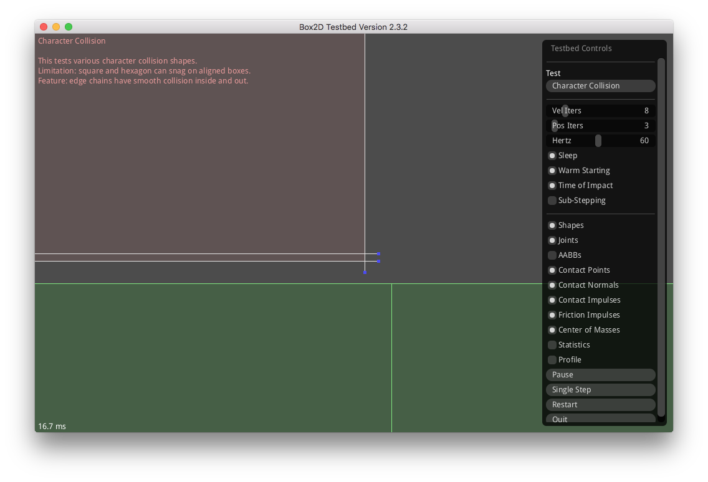
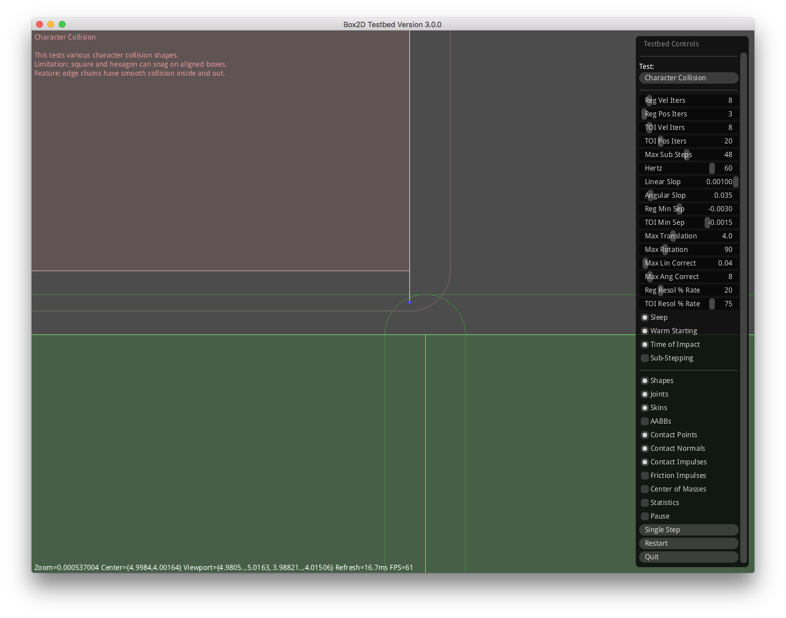

# Collision Handling

This is a write-up of how I've changed the collision handling.

## The Original Handling

In Box2D 2.3.2 (built from Erin Cato's sources), a box that comes down on top
of a flat surface made up of other boxes, that's then dragged across that
surface, sometimes gets stuck. It can be moved backward or upward, but it
basically won't move across any further in the direction it had gotten stuck
going in.

A close-up (zoomed-in) inspection of the Character Collision Testbed test of
this kind of scenario, where a box that had been dragged down onto a surface
of boxes and then dragged across it from left to right, shows the following:

Note the **blue** dots near the center of the image and the lines that they're
connected to. These indicate the directions from which impulses are applied.

The impulses are due to contacts being dealt with:
 - a contact between the upper box atop the lower box, and
 - a contact between the upper box and the lower box just to the right.

It doesn't look like these contacts are happening, but that's only because the
boxes' "skins" - padded extensions to the boxes - are actually where the
contacts are happening and these **aren't** drawn in this image.

As to the impulses, there's an upward impulse, and two impulses applied
leftward.
The upward impulse is desirable. It's basically keeping the upper box from
falling down any further.
The leftward impulses however, they're counter to the direction the upper box
was being dragged.

Boom! Icky-stickiness.

## Rounded Corner Handling

As I looked into the minutia of how collisions were handled at the "skin"
scale, I realized that while there is a circular notion of a vertex radius at
the corners of all the shape types, for polygon-polygon collisions, these were
being treated as squared corners. The previously shown image is an example of
this. The lower-right corner of the upper box isn't seeing any impulse that's
in the direction of the upper-left corner of the lower box. Instead, it's
only seeing impulses that are in the directions of the edge normals.

Not satisfied with squared off impulse responses, I introduced rounded corner
collision handling into my fork of Box2D (like was being done for circle-circle
collisions). Rounded corner collision handling for a top rectangle dragged
across the lower rectangles from the right of the image to the left, then
instead looks like this (using the Testbed built from my fork of the project
that has extra functionality like drawing the "skins"):

Note the blue dots and lines in this image.

There's still and upward impulse being applied. But now instead of any impulses
being applied directly against the direction of motion, the impulse is applied
at an off-angle to the motion.

Less icky-stickiness!

While rounded corner collisions aren't as simple computationally, they've been
appealing to me ever since for several reasons:
 1. They had the effect of reducing how much the top rectangle would get stuck
    when dragged across flat aligned edges or rectangles.
 2. The rounded collision effect suggested to me that the collision manifold
    calculation for two polygons could be generalized for calculating the
    collision manifold for any two N-gons from an N of 1 on up.

## Modified Corner Handling

While rounded corner collisions were an improvement to me, I thought that for
polygons having much longer edges than their corner radiuses, it'd be better to
have no portion of the impulse response resisting the dragged motion at all.
I'm calling this response the modified corner handling and it results in
collision handling that now looks like this (again using the Testbed built
from my fork of the project):

And now, no stickiness at all!! Woot!!

## The Details

Someone asked me for more details. I love that! Even one person asking a question about
what I've done is hugely encouraging for me. So here's more information...

Code-wise, this now (as of around May, 2017) gets done in [`Manifold.cpp`](https://github.com/louis-langholtz/Box2D/blob/dev/Box2D/Collision/Manifold.cpp), by the `box2d::CollideShapes` function. It's full function signature is:

    namespace box2d {

        Manifold CollideShapes(const DistanceProxy& shapeA, const Transformation& xfA,
                               const DistanceProxy& shapeB, const Transformation& xfB,
                               const Manifold::Conf conf);

    } // namespace box2d

What's relevant to note about the function signature is really only that it takes `DistanceProxy`
objects and returns `Manifold` objects.
That's relevant because it means that the function takes any arbitrary pair of convex
shapes that have from one to `MaxShapeVertices` (i.e. up to 254 vertices) and returns
a calculated manifold for them.

Algorithmically speaking, things get harder for me to explain.
Pull requests for improvements to this document are greatly welcome.
In the meantime, here goes...

The `CollideShapes` function decomposes its work into essentially three categories
of possible convex-shape to convex-shape collisions (contacts where the two shapes
are touching and possibly overlapping):

 1. Single vertex shape to single vertex shape collisions - which are perhaps more recognizable
    as *circle* to *circle* collisions.
 2. Single vertex shape to multi vertex shape collisions - like *circle* to *edge* or *circle*
    to *polygon* collisions.
 3. Multi vertex shape to multi vertex shape collisions - as in an *edge* or *polygon* shape
    colliding with another *edge* or *polygon* shape.

It's this last category of collisions that's most relevant to the original stickiness problem:
the multi vertex shape to multi vertex shape collisions - like for a rectangle over boxes.

In the multi vertex shape to multi vertex shape collision case,
the maximum separation between shapes is calculated using each shape's edge normals.
What's returned from these two calculations is that maximum separation amount and the indices
of the two shapes for which the maximum was found.
This is similar to what `b2FindMaxSeparation` (in Erin's source) does
and how it's used, except that instead of returning one index, two are returned so that
the second index doesn't essentially need to be recalculated again.
If either of the maximum separation amounts are greater than the total radius, the
algorithm ends and a non-touching / non-overlapping manifold is returned (returned from the
`CollideShapes` function that is).
In the continuing on case (where the algorithm doesn't), things now get more convoluted
(at least in the implementation where execution is now in the `GetFaceManifold` function
  which is akin to the latter code in Erin's `b2CollidePolygons` function).

Now clipping is attempted between the actual vertices; **not offsets to those vertices**.
If two clip points are found, then a collision manifold is generated having a manifold point
for each of the clip points whose edge-normal distance minus the *front offset* is less than
the total vertex radius. This is just as Erin's code does this.
If the resulting manifold has one or two manifold points, the algorithm ends and returns
that manifold.
If two clip points weren't found or the resulting manifold from the last step didn't have
any manifold points however, things continue on and get more interesting.

The algorithm is now looking at the potential case of corner to corner collisions.
Here the algorithm essentially looks to determine which edge of the secondary shape
that the primary shape's corner is closer to **in terms of that edge's normal**.
If the length of this edge is greater than a specified amount (given in the `conf` parameter),
then the algorithm switches from returning the *circles* type of collision manifold
to figuring out a face type of collision manifold. This is the break out point between
the *rounded* corner-collision handling and face corner-collision handling. This split
off from returning *circles* manifolds back to returning face type manifolds is the
*modified corner handling*.

Incidentally, I'm very open to a better name for the modified corner handling.
But back to the algorithm...

Returning the *circles* manifold results in the rounded corner handling
shown earlier. For say two edge shapes with vertex radiuses that are as large as these edges
are long, I think the rounded corner response makes sense. If we imagined what these shapes
look like with their *skins* drawn, we'd see very rounded capsule shapes like *Weebles*.
I'd want these shapes to teeter and possibly wobble (and maybe even fall down).
The scale at which the collision response should switch between rounded corners and squared-like
corners I think is enough of a matter of preference though that I made it configurable
(specified in the `conf` parameter).

Returning the face type of manifold meanwhile now results in no opposing impulses, which
results in smooth sliding and no impulses that oppose the direction of sliding. This is
because of the previously mentioned edge determination and one other factor:
the pre-existing downward skin penetration in the sliding scenario.
This pre-existing downward penetration then favors the edge (to the corner of the upcoming shape)
*whose normal is up*, instead of the edge whose normal opposes the direction of travel.
And voila!
