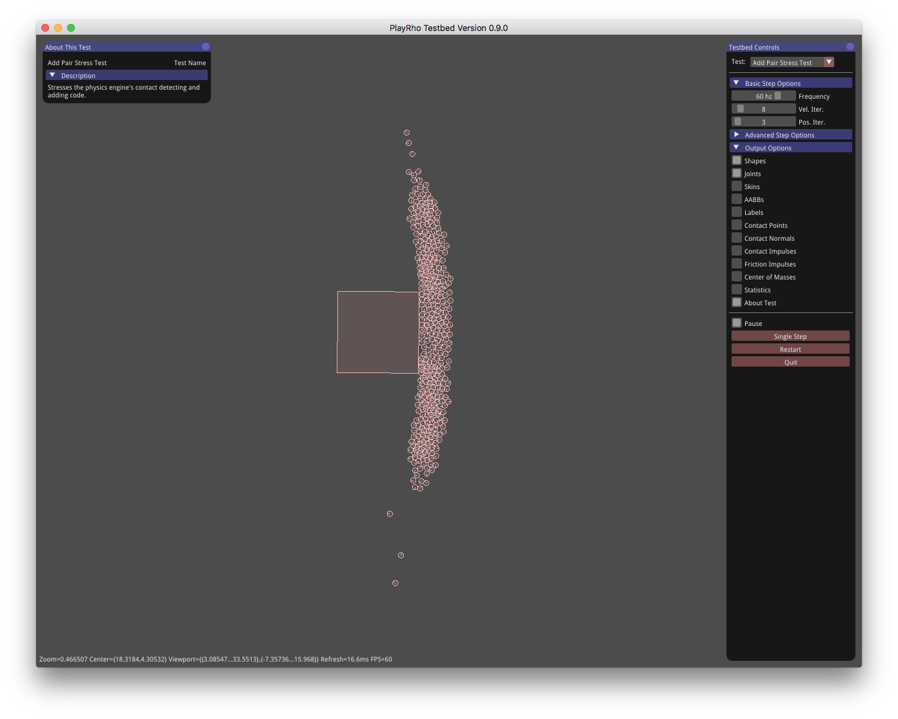
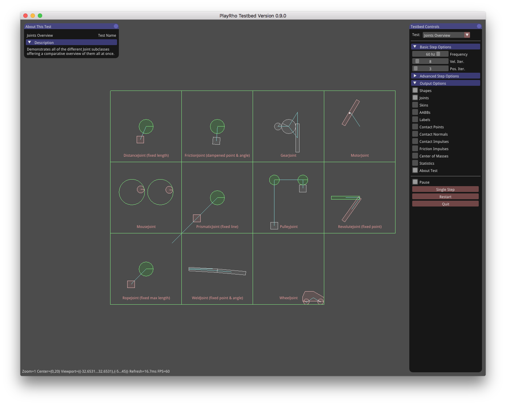

# Testbed GUI Application Tests Directory

This directory is for classes which sub-class the Testbed's `Test` base class.
You don't really need to know anything about it unless you want to add your own
code to the Testbed.

Subclassing `Test` is *part one* of the way to integrate code into the Testbed
GUI application for demoing and visually testing code. After getting the
subclass initially setup, *part two* of integrating code into the Testbed,
is to add a reference to the subclass to the
[TestEntry.cpp](../Framework/TestEntry.cpp) file that's over in the `Framework`
directory.

See also the [Testbed README](../README.md).

## Images

Here's some images of what these look like when run.

### [`AddPair.cpp`](AddPair.cpp)

### [`ApplyForce.cpp`](ApplyForce.cpp)

### [`BagOfDisks.cpp`](BagOfDisks.cpp)

### [`BasicSliderCrank.cpp`](BasicSliderCrank.cpp)

### [`BodyTypes.cpp`](BodyTypes.cpp)

### [`Breakable.cpp`](Breakable.cpp)

### [`BreakableTwo.cpp`](BreakableTwo.cpp)

### [`Bridge.cpp`](Bridge.cpp)

### [`BulletTest.cpp`](BulletTest.cpp)

### [`Cantilever.cpp`](Cantilever.cpp)

### [`Car.cpp`](Car.cpp)

### [`Chain.cpp`](Chain.cpp)

### [`CharacterCollision.cpp`](CharacterCollision.cpp)

### [`CollisionFiltering.cpp`](CollisionFiltering.cpp)

### [`CollisionProcessing.cpp`](CollisionProcessing.cpp)

### [`CompoundShapes.cpp`](CompoundShapes.cpp)

### [`Confined.cpp`](Confined.cpp)

### [`ContinuousTest.cpp`](ContinuousTest.cpp)

### [`ConvexHull.cpp`](ConvexHull.cpp)

### [`ConveyorBelt.cpp`](ConveyorBelt.cpp)

### [`DistanceTest.cpp`](DistanceTest.cpp)

### [`Dominos.cpp`](Dominos.cpp)

### [`DumpShell.cpp`](DumpShell.cpp)

### [`EdgeShapes.cpp`](EdgeShapes.cpp)

### [`EdgeTest.cpp`](EdgeTest.cpp)

### [`FifteenPuzzle.cpp`](FifteenPuzzle.cpp)

### [`Gears.cpp`](Gears.cpp)

### [`HalfPipe.cpp`](HalfPipe.cpp)

### [`HeavyOnLight.cpp`](HeavyOnLight.cpp)

### [`HeavyOnLightTwo.cpp`](HeavyOnLightTwo.cpp)

### [`JointsTest.cpp`](JointsTest.cpp)

### [`Mobile.cpp`](Mobile.cpp)

### [`MobileBalanced.cpp`](MobileBalanced.cpp)

### [`MotorJoint.cpp`](MotorJoint.cpp)

### [`NewtonsCradle.cpp`](NewtonsCradle.cpp)

### [`OneSidedPlatform.cpp`](OneSidedPlatform.cpp)

### [`Orbiter.cpp`](Orbiter.cpp)

### [`Pinball.cpp`](Pinball.cpp)

### [`PolyCollision.cpp`](PolyCollision.cpp)

### [`PolyShapes.cpp`](PolyShapes.cpp)

### [`Prismatic.cpp`](Prismatic.cpp)

### [`Pulleys.cpp`](Pulleys.cpp)

### [`Pyramid.cpp`](Pyramid.cpp)

### [`RayCast.cpp`](RayCast.cpp)

### [`Revolute.cpp`](Revolute.cpp)

### [`RopeJoint.cpp`](RopeJoint.cpp)

### [`SensorTest.cpp`](SensorTest.cpp)

### [`ShapeEditing.cpp`](ShapeEditing.cpp)

### [`SliderCrank.cpp`](SliderCrank.cpp)

### [`SphereStack.cpp`](SphereStack.cpp)

### [`SpinningCircle.cpp`](SpinningCircle.cpp)

### [`TheoJansen.cpp`](TheoJansen.cpp)

### [`Tiles.cpp`](Tiles.cpp)

### [`TimeOfImpact.cpp`](TimeOfImpact.cpp)

### [`Tumbler.cpp`](Tumbler.cpp)

### [`VaryingFriction.cpp`](VaryingFriction.cpp)

### [`VaryingRestitution.cpp`](VaryingRestitution.cpp)

### [`VerticalStack.cpp`](VerticalStack.cpp)

### [`Web.cpp`](Web.cpp)

### [`iforce2d_TopdownCar.cpp`](iforce2d_TopdownCar.cpp)

### [`iforce2d_Trajectories.cpp`](iforce2d_Trajectories.cpp)

